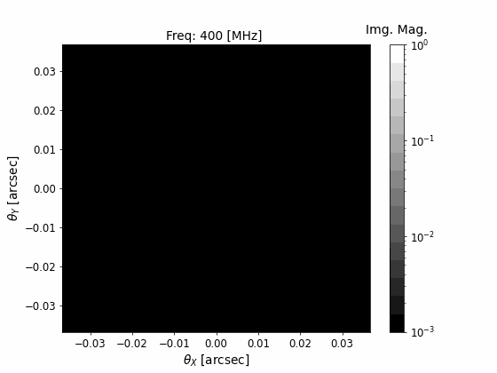

# RWLensPy

This is a python package that generates observed morphologies and propagation transfer functions for radio wave propgation recorded by a radio telescope.

The code can be installed with:

`pip install rwlenspy`

## Examples

For examples see `examples/`. The image ray trace is shown in the `example_animate_*.py` files and how to get the coherent transfer function for a baseband simulation is shown in `example_transfer*.py`.

    

## Custom/Dev Install

The package is built with Poetry and Cython using C++11 and OpenMP. This requires having a compiler like `gcc` if one is editing the code. If one requires a dev install, this can be done with:

`poetry install --with test,dev`

`poetry run python`

Once installed, tests can be run with:

`poetry run pytest`
